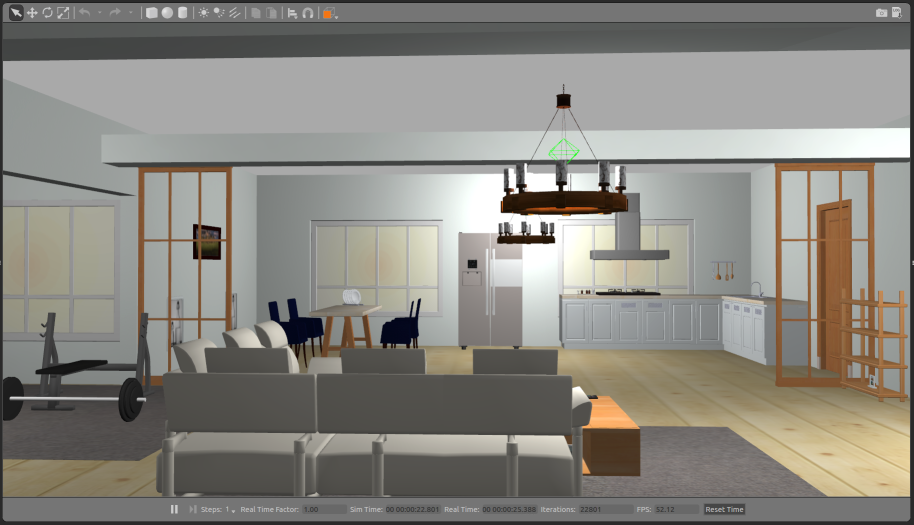
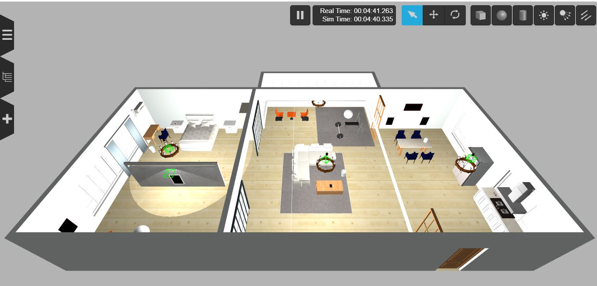

# AWS RoboMaker Small House World ROS package



## AWS Robomaker Small House World on Gzweb

## AWS Robomaker Small House World on Gzweb

**Visit the [AWS RoboMaker website](https://aws.amazon.com/robomaker/) to learn more about building intelligent robotic applications with Amazon Web Services.**

# Include the world from another package

* Update .rosinstall to clone this repository and run `rosws update`
```
- git: {local-name: src/aws-robomaker-small-house-world, uri: 'https://github.com/aws-robotics/aws-robomaker-small-house-world.git', version: ros1}
```
* Add the following to your launch file:
```xml
<launch>
  <!-- Launch World -->
  <include file="$(find aws_robomaker_small_house_world)/launch/small_house.launch"/>
  ...
</launch>
```

# Load directly into Gazebo (without ROS)
```bash
export GAZEBO_MODEL_PATH=`pwd`/models
gazebo worlds/small_house.world
```

## Example: Running this world on Gazebo headless and running the UI on Gzweb
*Tested in ROS Kinetic/Melodic, Gazebo 7/9 with node version 8.11.3/10.22.1*

To open this world in Gzweb, There are two steps,

1) In a terminal, change  to your ROS workspace root folder and run gzserver with the small warehouse world:

```bash
cd aws-robomaker-small-house-world
export GAZEBO_MODEL_PATH=`pwd`/models
gzserver worlds/small_house.world --verbose
```

2) In another terminal, setup and run GzWeb
- Install GzWeb by following the [official documentation](http://gazebosim.org/gzweb#install-collapse-1):

  **Important**:
  * The recommended NodeJS versions are 4 up to version 8.  
  * Watch out for [conflicting installations of Node/NodeJS](https://askubuntu.com/questions/695155/node-nodejs-have-different-version)
  * See [Troubleshooting section](http://gazebosim.org/gzweb#install-collapse-3) for other issues

- Deploy GzWeb
    - export Gazebo model path and run the deploy script with `-m local`

    ```bash
    cd aws-robomaker-small-house-world
    export GAZEBO_MODEL_PATH=`pwd`/models
    cd ~/gzweb
    export GAZEBO_MASTER_URI="http://localhost:11345" # change localhost to IP address of the gzserver machine
    npm run deploy --- -m local
    npm start
    ```
*Note: For Portrait Images put the required images mentioned in each visual.DAE file to each materials/textures folder because gzweb could only use the assets mentioned in gzweb/http/client/assets folder for each model.* 

# ROS Launch with Gazebo viewer (without a robot)
```bash
# build for ROS
rosdep install --from-paths . --ignore-src -r -y
colcon build

# run in ROS
source install/setup.sh
roslaunch aws_robomaker_small_house_world view_small_house.launch
```

# Building
Include this as a .rosinstall dependency in your SampleApplication simulation workspace. `colcon build` will build this repository.

To build it outside an application, note there is no robot workspace. It is a simulation workspace only.

```bash
$ rosws update
$ rosdep install --from-paths . --ignore-src -r -y
$ colcon build
```

# How to Replace Photos in Picture Frames

Picture frames use two textures for the model:
 - `aws_portraitA_01.png` - Frame texture
 - `aws_portraitA_02.png` - Picture texture

To change a picture, one has to replace the `aws_portraitA_02.png` file. The new image will look best with same aspect ratio as the replaced image.

Below is a table showing portrait type to picture resolution data and custom images from photos/.

| Portrait Model | Resolution | Photo |
| --- | --- | --- |
| DeskPortraitA_01 | 650x1024 | |
| DeskPortraitA_02 | 650x1024 | doug |
| DeskPortraitB_01 | 650x1024 | |
| DeskPortraitB_02 | 650x1024 | |
| DeskPortraitC_01 | 1024x1024 | |
| DeskPortraitC_02 | 1024x1024 | |
| DeskPortraitD_01 | 1024x1024 | |
| DeskPortraitD_02 | 1024x1024 | |
| DeskPortraitD_03 | 1024x1024 | |
| DeskPortraitD_04 | 1024x1024 | ray |
| PortraitA_01 | 700x1024 | tim |
| PortraitA_02 | 700x1024 | anamika |
| PortraitB_01 | 700x1024 | renato |
| PortraitB_02 | 700x1024 | brandon |
| PortraitB_03 | 700x1024 | miaofei |
| PortraitC_01 | 650x1024 | sean |
| PortraitD_01 | 1024x450 | |
| PortraitD_02 | 1024x450 | |
| PortraitE_01 | 700x1024 | maggie |
| PortraitE_02 | 700x1024 | iftach |

# Disclaimer

All objects in the scene should be static objects as intended for this sample app.
If there is a need for some of objects to be non-static, change their 'static' flag in the world file to 'false', 
and make sure they have correct mass and inertia values in their model.sdf
Link: http://gazebosim.org/tutorials?tut=inertia&cat=build_robot

Currently, objects in scene have inconsistent mass and inertia values, they will be fixed in the future change.
Inconsistent mass and inertia should not affect static object simulation.


