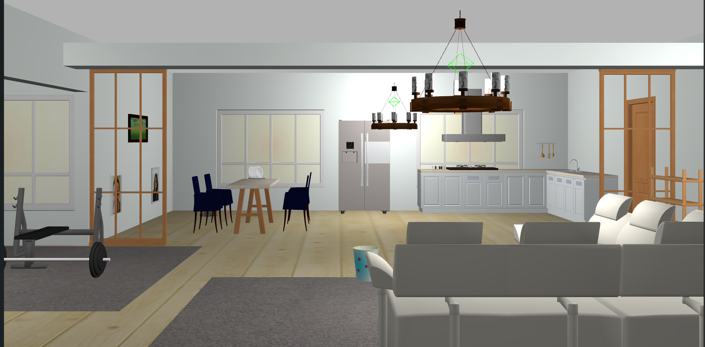

# AWS RoboMaker Small House World ROS package

**This is a pre-release. Do not consume.**



# Include the world from another package

* Update .rosinstall to clone this repository and run `rosws update`
```
- git: {local-name: src/aws-robomaker-small-house-world, uri: 'https://github.com/aws-robotics/aws-robomaker-small-house-world.git', version: master}
```
* Add the following to your launch file:
```xml
<launch>
  <!-- Launch World -->
  <include file="$(find aws_robomaker_small_house_world)/launch/small_house.launch"/>
  ...
</launch>
```

# Load directly into Gazebo (without ROS)
```bash
export GAZEBO_MODEL_PATH=`pwd`/models
gazebo worlds/small_house.world
```

# ROS Launch with Gazebo viewer (without a robot)
```bash
# build for ROS
rosdep install --from-paths . --ignore-src -r -y
colcon build

# run in ROS
source install/setup.sh
roslaunch aws_robomaker_small_house_world view_small_house.launch
```

# Robot Simulation
Do not use (0,0,0) for the initial position as it will collide with the lounge chairs. Instead, use (-3.5,1.0,0.0).  

With Turtlebot Waffle PI initially positioned between the living and kitchen:
```
export TURTLEBOT3_MODEL=waffle_pi
export ROBOT_INITIAL_POSE="-x 3.5 -y 1.0 -z 0.0 -R 0.0 -P 0.0 -Y 0.0"
roslaunch turtlebot_gazebo turtlebot_world.launch  world_file:=`pwd`/worlds/small_house.world
```

# Building
Include this as a .rosinstall dependency in your SampleApplication simulation workspace. ~colcon build` will build this repository.  

To build it outside an application, note there is no robot workspace. It is a simulation workspace only. 

```bash
$ rosws update
$ rosdep install --from-paths . --ignore-src -r -y
$ colcon build
```
 

# Navigation
A SLAM-generated map for *Turtlebot Waffle PI* is included with a pre-defined route.

## Run Navigation with Gazebo viewer:
```bash
export TURTLEBOT3_MODEL=waffle_pi
roslaunch aws_robomaker_small_house_world small_house_turtlebot_navigation.launch gui:=true
```

## Run Navigation with RViz (and Gazebo viewer):
```bash
export TURTLEBOT3_MODEL=waffle_pi
roslaunch aws_robomaker_small_house_world small_house_turtlebot_navigation.launch open_rviz:=true gui:=true
```

### Run RViz separately for navigation 

This will show you the SLAM map and current plan.

Locally,
```
rviz -d rviz/turtlebot3_navigation.rviz
```

In RoboMaker RViz viewer, use File -> Open:
```
.../workspace/<robot|simulation>-application/bundle/opt/aws_robomaker_small_house_world/share/aws_robomaker_small_house_world/rviz/turtlebot3_navigation.rviz
```


# How to Replace Photos in Picture Frames

Picture frames use two textures for the model:
 - `aws_portraitA_01.png` - Frame texture
 - `aws_portraitA_02.png` - Picture texture

To change a picture, one has to replace the `aws_portraitA_02.png` file. The new image will look best with same aspect ratio as the replaced image.

Below is a table showing portrait type to picture resolution data and custom images from photos/.

| Portrait Model | Resolution | Photo |
| --- | --- | --- |
| DeskPortraitA_01 | 650x1024 | |
| DeskPortraitA_02 | 650x1024 | doug |
| DeskPortraitB_01 | 650x1024 | |
| DeskPortraitB_02 | 650x1024 | |
| DeskPortraitC_01 | 1024x1024 | |
| DeskPortraitC_02 | 1024x1024 | |
| DeskPortraitD_01 | 1024x1024 | |
| DeskPortraitD_02 | 1024x1024 | |
| DeskPortraitD_03 | 1024x1024 | |
| DeskPortraitD_04 | 1024x1024 | ray |
| PortraitA_01 | 700x1024 | tim |
| PortraitA_02 | 700x1024 | anamika |
| PortraitB_01 | 700x1024 | renato |
| PortraitB_02 | 700x1024 | brandon |
| PortraitB_03 | 700x1024 | miaofei |
| PortraitC_01 | 650x1024 | sean |
| PortraitD_01 | 1024x450 | |
| PortraitD_02 | 1024x450 | |
| PortraitE_01 | 700x1024 | maggie |
| PortraitE_02 | 700x1024 | iftach |

